# Configure IBM API Connect native OAuth provider with OpenLDAP as authentication registry


>**NOTE:** This document is written in hurry and it is in a very draft state. I apologize for all typos and inconsistencies. Hopefully, it will be improved later.


## Setup OpenLDAP on OpenShift cluster

Clone the following repository with the sample configuration:
```
git clone https://github.com/jdiggity22/openldap.git
```

You will find a sample *ldif* file in the following location:
```
openldap/bootstrap/ldif/openldap-default.ldif
```
It contains a several predefined users and groups. Please correct it to fit your requirements.

The base name is `dc=ibm,dc=com`. Admin user is `cn=admin,dc=ibm,dc=com` with password `Passw0rd`
Please check the configuration and correct it accordingly.

Navigate to the base folder and build the image. I am using `podman` in this example, but you can equally use `docker` as well. 

```
cd openldap

export NAME=osixia/extend-osixia-openldap
export VERSION=0.1.0

podman login docker.io

podman build -t $NAME:$VERSION --rm .
```  

Login to your OpenShift cluster and create project called "openldap":
```
oc new-project openldap
```  

>**NOTE:** In the followng steps, I am using the subdomain of my OpenShift cluster which is `.apps.ocp410.tec.uk.ibm.com` Please correct commands to use your subdomain.

Get the URL of OpenShift's internal registry:
```
oc registry info
```

In my case the result was:
```
default-route-openshift-image-registry.apps.ocp410.tec.uk.ibm.com
```
If your registry is not exposed to the external world you will have to create a route to expose it. Please check the OpenShift documentation.

Login to OpenShift image registry
```
podman login -u $(oc whoami) -p $(oc whoami -t) default-route-openshift-image-registry.apps.ocp410.tec.uk.ibm.com --tls-verify=false
```

List local images. The image that you have built before must appear on the list.
```
podman images | grep openldap
```

Tag this image to be able to push it to the OpenShift registry:
```
podman tag osixia/extend-osixia-openldap:0.1.0 default-route-openshift-image-registry.apps.ocp410.tec.uk.ibm.com/openldap/openldap:1.0.0
```

Push it:
```
podman push default-route-openshift-image-registry.apps.ocp410.tec.uk.ibm.com/openldap/openldap:1.0.0 --tls-verify=false
```

Apply the security setting to your OpenShift project
```
oc adm policy add-scc-to-group anyuid system:serviceaccounts:openldap
```

Create deployment and servce in your **openldap** project
```yaml
apiVersion: apps/v1
kind: Deployment
metadata:
 name: openldap
 labels:
   app: openldap
spec:
  replicas: 1
  selector:
    matchLabels:
      app: openldap
  template:
   metadata:
     labels:
       app: openldap
   spec:
     containers:
       - image: image-registry.openshift-image-registry.svc:5000/openldap/openldap:1.0.0
         imagePullPolicy: Always
         name: openldap
         ports:
           - containerPort: 389
             protocol: TCP
---
apiVersion: v1
kind: Service
metadata:
 labels:
   app: openldap
 name: ldap-service
spec:
 ports:
   - name: openldap
     port: 389
 selector:
   app: openldap

```

Wait until the *openldap* pod is up and running:
```
oc get pods -n openldap

NAME                       READY   STATUS    
openldap-5fc44f956-7xfb8   1/1     Running  
```

Check services in the *openldap* project:
```
oc get services -n openldap
```

The response should be similar to this:
```
NAME           TYPE        CLUSTER-IP      EXTERNAL-IP   PORT(S)   AGE
ldap-service   ClusterIP   172.30.20.102   <none>        389/TCP   72m    
```

That means that your LDAP is available at (the IP addrress will be different in your case):
```
ldap://172.30.20.102:389
``` 

Or, event better, using the internal DNS:
```
ldap://ldap-service.openldap.svc.cluster.local:389
```


## Setup LDAP user registry in API Connect


In your API Manager navigate to **Resources > User registries** and click on **Create**

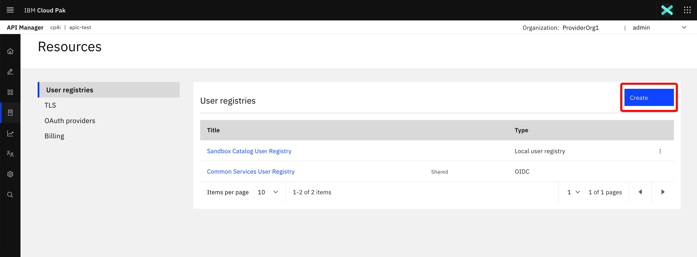

Select **LDAP user registry**

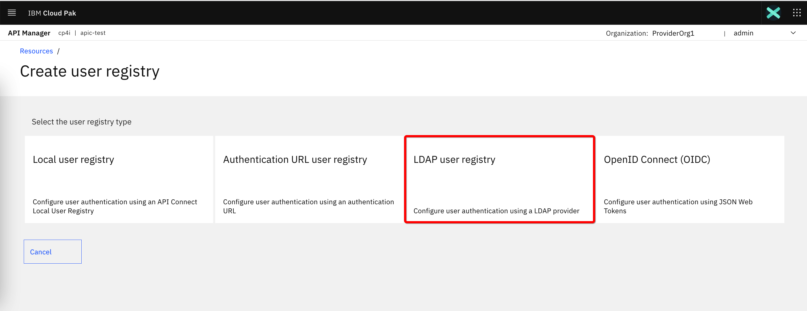

Give it some name and enter the address (without protocol specification) and port:
- Address: `ldap-service.openldap.svc.cluster.local`
- Port: `389`

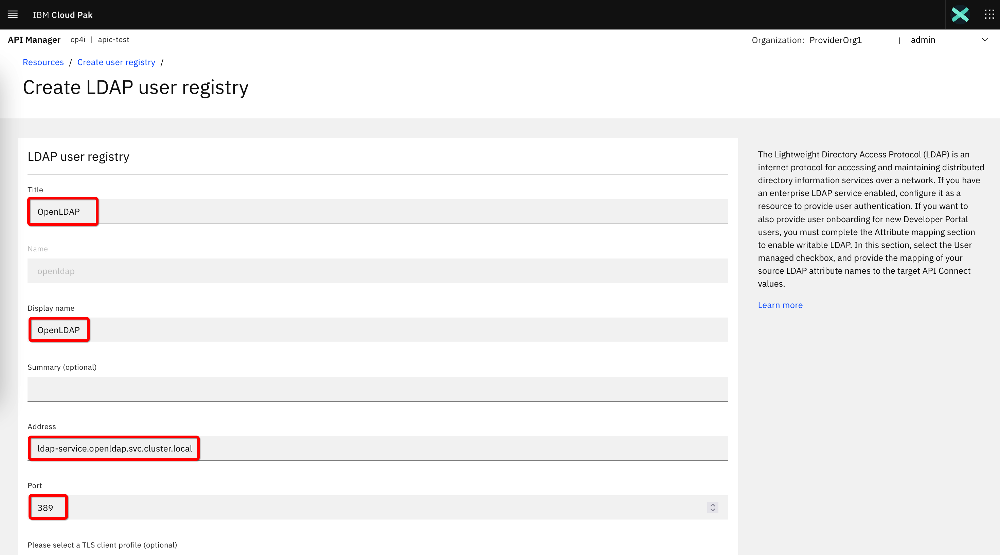

Scroll down, accept default values for other properties and click **Next**:

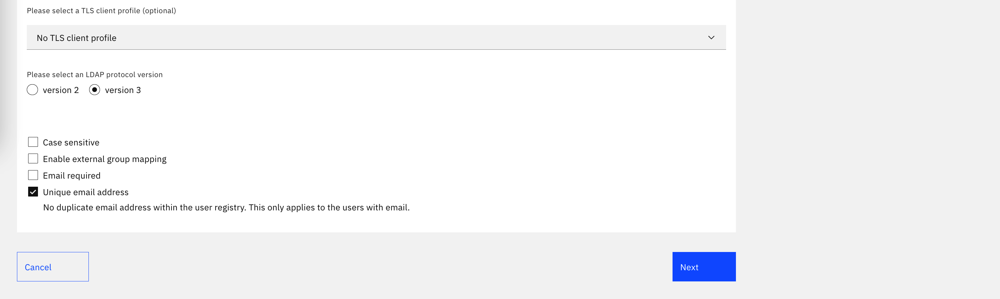 

The properties on the next page are crucial for the correct setup. 
- For authentication method select: **Compose DN**
- For bind method select: **Authenticated bind**

>**NOTE:** For the rest of the properties, I am showing here the values as it were in the original LDAP onfiguration that we cloned at the beginning of this document. Correct them accordingly if you adapted the setting for your case.

- Admin DN: `cn=admin,dc=ibm,dc=com` 
- Admin password: `Passw0rd` 
- Prefix: `uid=`
- Suffix: `,ou=users,dc=ibm,dc=com`
- Click on the button **Get Base DN** and then select the base DN
- Base DN: `dc=ibm,dc=com`
- Click on button **Test configuration** and enter the user name and password of any of the users defined in the *ldif*, for example *sarah/Passw0rd* 
- Click on **Create** button on the bottom to confirm the configuration

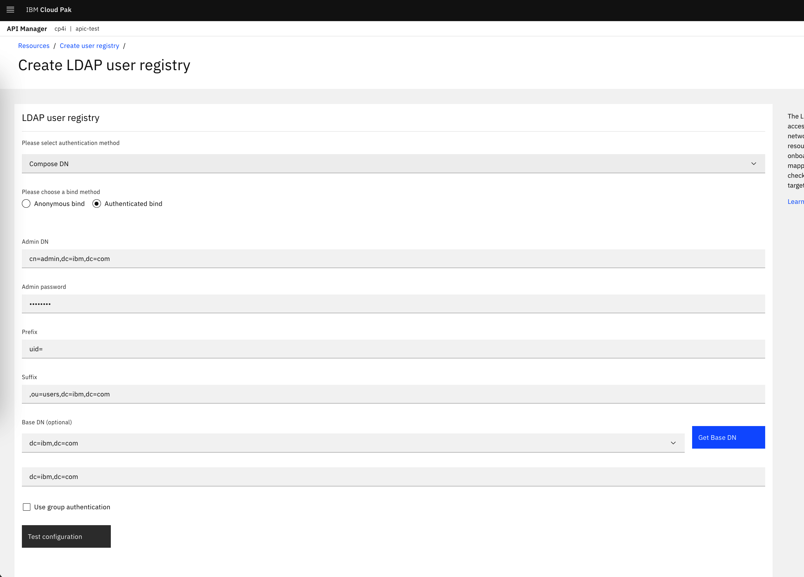 

Your LDAP will appear on the list of registries:

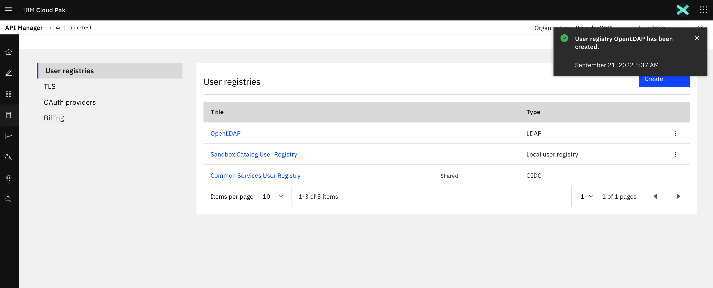

## Create OAuth provider

In the API Manager, navigate to **Resources > OAuth providers**, click on **Add** and select **Native OAuth provider**

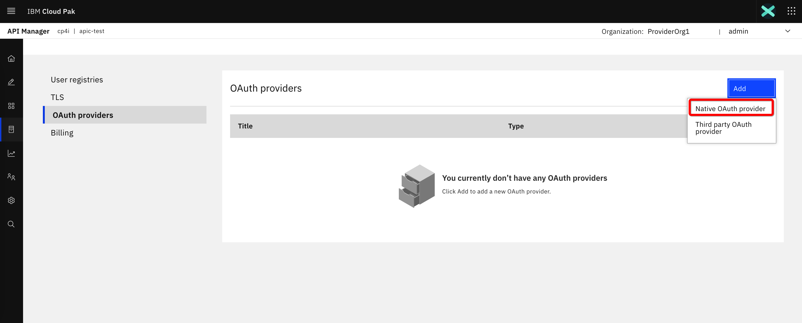

Follow the standard steps for name, grant type, scope etc...

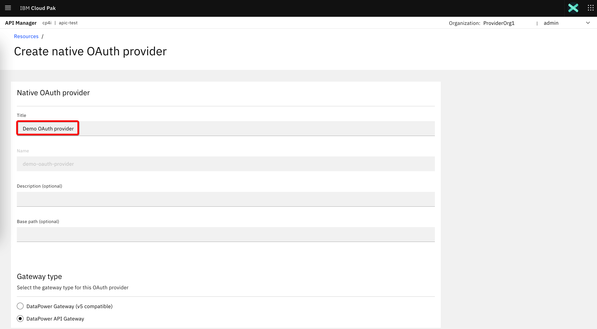

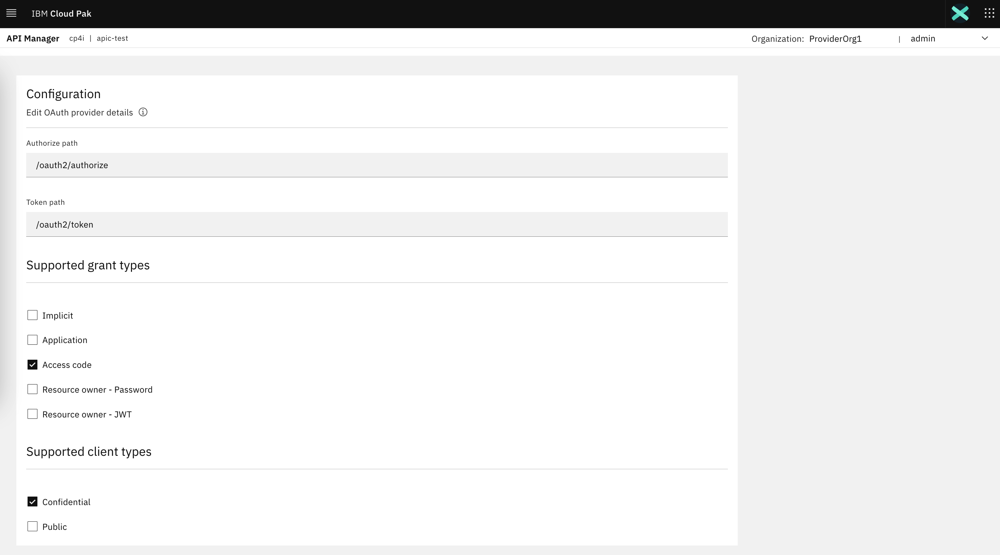

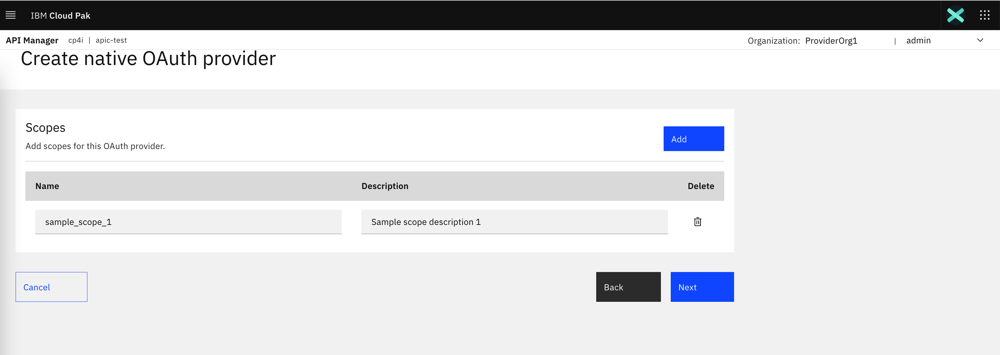

Select our **OpenLDAP** user registry for the authentication

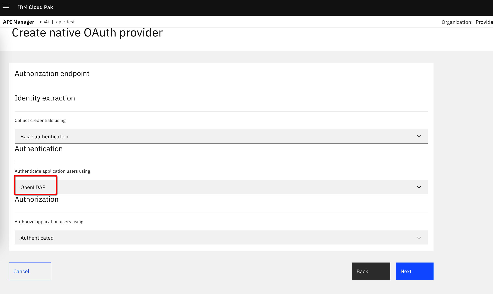

Continue with the standard steps to conclude the provider creation:

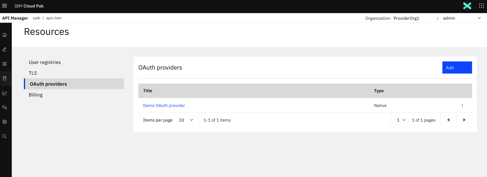


